# Coloretto - Implementacion en C++

## Descripcion

Este proyecto es una implementacion digital del juego de mesa **Coloretto** para 3 a 5 jugadores. El objetivo es obtener la mayor puntuacion al final de la partida coleccionando estrategicamente cartas de colores. El proyecto hace uso de **memoria dinamica** (malloc) para la gestion de estructuras de datos clave como lo requiere el proyecto.

## Equipo de Desarrollo

| Nombre | Rol | Responsabilidad |
|--------|-----|-----------------|
| **Juan** | Coordinador | Logica principal del juego, ciclo de turnos, inicializacion |
| **Ivan** | Developer | Gestion de jugadores, sistema de puntuacion |
| **Stella** | Developer | Gestion de baraja, cartas y pilas |

## Caracteristicas Implementadas

- Soporte para **3 a 5 jugadores** (dinamico)
- Uso de **6 colores activos** (se remueve 1 de los 7 colores base)
- Gestion dinamica de la **Baraja** y las **Pilas de Cartas**
- Implementacion del marcador de **"Ultima Ronda"**
- Calculo de puntuacion final segun las reglas oficiales de Coloretto
- **Memoria dinamica (malloc)** para todas las estructuras principales
- Sistema completo de turnos con opciones de jugador

## Reglas del Juego

### Objetivo
Acumular la mayor cantidad de puntos recolectando cartas de colores. **Solo los 3 colores con mas cartas dan puntos positivos**, el resto dan puntos negativos.

### Mecanica
1. En tu turno puedes:
   - **Robar una carta** del mazo y colocarla en una de las pilas disponibles
   - **Tomar una pila completa** y pasar el turno

2. Cada pila puede tener un maximo de **3 cartas**

3. Cuando todos los jugadores han tomado una pila, se inicia una nueva ronda

4. El juego termina cuando aparece la carta **"Ultima Ronda"**

### Sistema de Puntuacion

**Colores con MAS cartas (Top 3)** - Puntos POSITIVOS:
- 1 carta = 1 punto
- 2 cartas = 3 puntos
- 3 cartas = 6 puntos
- 4 cartas = 10 puntos
- 5 cartas = 15 puntos
- 6+ cartas = 21 puntos

**Otros colores** - Puntos NEGATIVOS:
- 1 carta = -1 punto
- 2 cartas = -3 puntos
- 3 cartas = -6 puntos
- 4+ cartas = -10 puntos

## Estructura del Proyecto

```
Coloretto/
├── src/
│   ├── main.c           # Funcion principal y flujo del juego
│   ├── game_logic.c     # Ciclo de juego y control de partida
│   ├── player.c         # Gestion de jugadores y puntuacion
│   └── deck.c           # Gestion de baraja, cartas y pilas
├── include/
│   ├── common.h         # Constantes y tipos comunes
│   ├── game_logic.h     # Declaraciones de logica de juego
│   ├── player.h         # Declaraciones de jugadores
│   └── deck.h           # Declaraciones de baraja
├── obj/                 # Archivos objeto (generado automaticamente)
├── README.md
├── Makefile
└── .gitignore
```

## Compilacion y Ejecucion

### Requisitos
- **GCC** (GNU Compiler Collection)
- **Make**
- **Valgrind** (opcional, para verificar memoria)

### Comandos
```bash
# Compilar el proyecto
make

# Compilar y ejecutar
make run

# Limpiar archivos compilados
make clean

# Verificar memoria con Valgrind
make valgrind

# Ver ayuda de comandos
make help
```

## Verificacion de Memoria

Para asegurar que no hay fugas de memoria (memory leaks):

```bash
make valgrind
```

**Resultado esperado**: `All heap blocks were freed -- no leaks are possible`

## Uso de Memoria Dinamica

El proyecto cumple con el requisito de usar **asignacion dinamica de memoria** de manera explicita mediante `malloc()` en las siguientes estructuras:

- Array de jugadores (Player**)
- Array de pilas (Pile**)
- Coleccion de cartas de cada jugador
- Cartas individuales (Card*)
- Estructura del mazo (Deck)
- Estructura principal del juego (Game)

Toda la memoria se libera correctamente al final del programa usando `free()`.

## Diagrama UML

```mermaid
---
title: Diagrama de Clases UML - Proyecto Coloretto
---
classDiagram
    %% ============================================
    %% ENUMERACION COLOR (STELLA)
    %% ============================================
    class Color {
        <<enumeration>>
        COLOR_RED
        COLOR_BLUE
        COLOR_GREEN
        COLOR_YELLOW
        COLOR_ORANGE
        COLOR_BROWN
        COLOR_GRAY
        COLOR_LAST_ROUND
    }

    %% ============================================
    %% CLASE CARD (STELLA)
    %% ============================================
    class Card {
        -Color color
        -int value
        +create_card(color, value) Card*
        +free_card(card) void
        +print_card(card) void
    }

    %% ============================================
    %% CLASE DECK (STELLA)
    %% ============================================
    class Deck {
        -Card** cards
        -int count
        -int capacity
        -int top_index
        +create_full_deck() Deck*
        +shuffle_deck(deck) void
        +draw_card(deck) Card*
        +deck_is_empty(deck) bool
        +free_deck(deck) void
        +print_deck(deck) void
    }

    %% ============================================
    %% CLASE PILE (STELLA)
    %% ============================================
    class Pile {
        -Card** cards
        -int count
        -bool is_full
        +create_pile() Pile*
        +add_card_to_pile(pile, card) bool
        +pile_is_full(pile) bool
        +pile_is_empty(pile) bool
        +clear_pile(pile) void
        +free_pile(pile) void
        +print_pile(pile, number) void
    }

    %% ============================================
    %% CLASE PLAYER (IVAN)
    %% ============================================
    class Player {
        -char* name
        -int id
        -Card** collected_cards
        -int card_count
        -int max_cards
        -int score
        -bool has_passed
        +create_player(name, id) Player*
        +free_player(player) void
        +add_card_to_collection(player, card) void
        +resize_card_collection(player) void
        +count_cards_by_color(player, color) int
        +calculate_score(player) void
        +get_positive_score(count) int
        +get_negative_score(count) int
        +find_top_3_colors(counts, indices) void
        +print_player_collection(player) void
        +print_score_breakdown(player) void
        +print_player_summary(player) void
        +reset_player_turn(player) void
    }

    %% ============================================
    %% CLASE GAME (JUAN)
    %% ============================================
    class Game {
        -Player** players
        -int num_players
        -Deck* main_deck
        -Pile** piles
        -int num_piles
        -int current_player_idx
        -int current_round
        -bool last_round_triggered
        -bool game_over
        -int players_passed_count
        +init_game() Game*
        +assign_initial_colors(game) void
        +prepare_game(game) void
        +game_is_running(game) bool
        +player_turn(game) void
        +handle_draw_card_action(game, pile_idx) bool
        +handle_take_pile_action(game, pile_idx) bool
        +next_player(game) void
        +all_players_passed(game) bool
        +reset_round(game) void
        +calculate_scores_and_declare_winner(game) void
        +get_winner(game) Player*
        +cleanup(game) void
        +display_game_state(game) void
        +display_piles(game) void
        +display_menu() void
        +display_welcome_message() void
        +display_final_results(game) void
        +get_player_choice() int
        +get_pile_selection(max_index) int
        +wait_for_enter() void
        +clear_input_buffer() void
        +print_separator() void
    }

    %% ============================================
    %% RELACIONES
    %% ============================================
    
    Card --> Color : uses
    Deck o-- Card : contains *
    Pile o-- Card : contains 0..3
    Player o-- Card : collects *
    Game *-- Player : has 3..5
    Game *-- Deck : has 1
    Game *-- Pile : has 3..5

    %% ============================================
    %% NOTAS
    %% ============================================
    
    note for Card "Responsable: Stella\n\nRepresenta una carta individual\ncon un color y valor.\n\nvalue:\n- 1 para colores normales\n- 0 para carta ultima ronda"
    
    note for Deck "Responsable: Stella\n\nBaraja principal del juego.\nUsa algoritmo Fisher-Yates\npara barajar.\n\nTotal: 55 cartas\n- 54 cartas de colores (6x9)\n- 1 carta ultima ronda\n\nUsa malloc para crear el\narray dinamico de cartas."
    
    note for Player "Responsable: Ivan\n\nGestiona la coleccion de cartas\nde cada jugador.\n\nSistema de puntuacion:\n- Top 3 colores: puntos positivos\n- Resto de colores: puntos negativos\n\nUsa realloc para redimensionar\nel array de cartas dinamicamente."
    
    note for Game "Responsable: Juan\n\nContenedor principal que\ncoordina todo el juego.\n\nSoporta 3-5 jugadores (variable).\nEl numero de pilas es igual al\nnumero de jugadores.\n\nControla:\n- Ciclo de turnos\n- Estado del juego\n- Interfaz de usuario\n- Limpieza de memoria\n\nUsa malloc para crear arrays\ndinamicos de jugadores y pilas."
    
    note for Pile "Responsable: Stella\n\nMaximo 3 cartas por pila.\nNumero de pilas en mesa: 3-5\n(igual al numero de jugadores)."
```



## Convenciones de Codigo

- **Funciones**: `snake_case` (ejemplo: `init_game`, `draw_card`)
- **Structs**: `PascalCase` (ejemplo: `Game`, `Player`, `Deck`)
- **Variables**: `snake_case` (ejemplo: `current_player`, `card_count`)
- **Constantes**: `UPPER_SNAKE_CASE` (ejemplo: `MAX_CARDS`, `NUM_PLAYERS`)

## Consideraciones del Proyecto

Este proyecto implementa una **version reducida** del juego original Coloretto segun las especificaciones del curso:

1. Modalidad de juego para **3 a 5 jugadores** (cantidad variable)
2. Uso obligatorio de **memoria dinamica** via malloc
3. Proyecto documentado y versionado en **Git**
4. Todos los integrantes demuestran aportes al proyecto mediante commits

## Autores

- **Juan** - Coordinador y Core Logic
- **Ivan** - Player Management System
- **Stella** - Deck and Cards System

---

**Version**: 1.0.0  
**Fecha**: Octubre 2025  
**Curso**: Estructura de Datos
