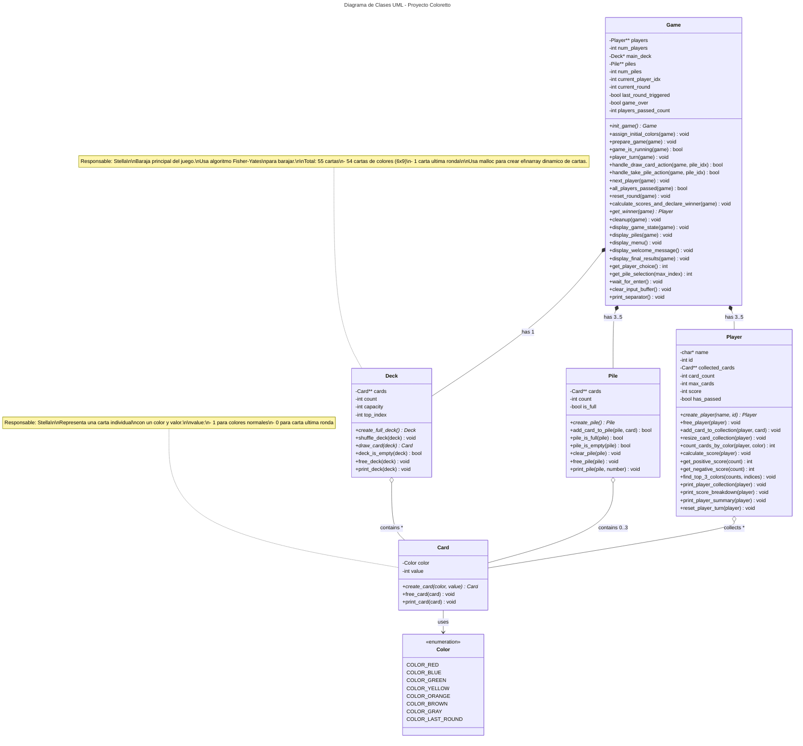

# Coloretto
Este proyecto consiste en el desarrollo del clásico juego de estrategia Coloreto, implementado completamente en C++, haciendo uso de memoria dinámica para la gestión eficiente de los datos del juego

    note for Player "Responsable: Ivan\n\nGestiona la coleccion de cartas\nde cada jugador.\n\nSistema de puntuacion:\n- Top 3 colores: puntos positivos\n- Resto de colores: puntos negativos\n\nUsa realloc para redimensionar\nel array de cartas dinamicamente."
    
    note for Game "Responsable: Juan\n\nContenedor principal que\ncoordina todo el juego.\n\nSoporta 3-5 jugadores (variable).\nEl numero de pilas es igual al\nnumero de jugadores.\n\nControla:\n- Ciclo de turnos\n- Estado del juego\n- Interfaz de usuario\n- Limpieza de memoria\n\nUsa malloc para crear arrays\ndinamicos de jugadores y pilas."
    
    note for Pile "Responsable: Stella\n\nMaximo 3 cartas por pila.\nNumero de pilas en mesa: 3-5\n(igual al numero de jugadores)."
